# Transport Layer public API contract

## Normative scope

This document defines the stable integration contract of the Transport facade.
Details in `extended_transport_design.md` are non-normative planning notes and
do not constrain the MVP unless they are later promoted here or into public
header contracts.

The MVP wire codec, CRC, COBS framing, bounded stream parser, workspace sizing,
initialization, private one-item reliable encoded-output lifecycle, and separate
private one-item control-output lifecycle are implemented. Public peek, commit,
and status still expose reliable output only; reset clears both private slots.
Session establishment, received-ACK dispatch, ACK generation, public output
arbitration, receive-side duplicate handling, Application-message orchestration,
delivery events, and session recovery remain intentional stubs unless stated
otherwise below.

Transport is HIL-RIG-specific but communication-medium-agnostic. It maps opaque,
complete Application messages to opaque encoded output and received raw bytes
back to complete Application messages. It never interprets Application meaning
or performs USB, UART, serial, DMA, RTOS, callback, clock, random-number, or
other platform operations.

## Ownership and execution

The caller owns:

- the `HIL_Transport_Context_T` object;
- one writable workspace described by `HIL_Transport_Storage_T`;
- the physical byte-stream implementation;
- monotonic time and link-state observations;
- the current local Transport operating mode; and
- a fresh starting session seed for a host context.

The selected private profile partitions the workspace. Those partitions, frame
scratch, session state, and retry buffers are not public. The workspace remains
at a stable address, writable, non-overlapping with active call buffers, and
exclusively owned by the context until it is discarded. The library never
allocates heap memory.

A non-NULL workspace must be aligned to
`HIL_TRANSPORT_WORKSPACE_ALIGNMENT`, which is based on `max_align_t` and is
sufficient for the MVP private root. `Required_Storage_Size` reports capacity
assuming this alignment; future `Init` rejects a misaligned workspace as
`INVALID_ARGUMENT`. C11 and C++ allocation examples are:

```c
_Alignas(HIL_TRANSPORT_WORKSPACE_ALIGNMENT)
static uint8_t workspace[WORKSPACE_SIZE];
```

```cpp
alignas(HIL_TRANSPORT_WORKSPACE_ALIGNMENT)
std::array<std::uint8_t, WorkspaceSize> workspace;
```

One context has exactly one owning task, thread, or execution context. Every API
call for that context originates from that owner. External locking does not make
cross-thread use supported. Callbacks and interrupts transfer work to the owner.
Separate contexts may have separate owners.

## Configuration and initialization

The caller zero-initializes both its configuration object and the complete
`HIL_Transport_Context_T` before setup. `HIL_TRANSPORT_Default_Config()` then
overwrites every configuration field with a deterministic starting value. The
caller applies required overrides, including a valid fresh seed for a host,
before querying storage and initializing.

`HIL_TRANSPORT_Default_Config()` provides a deterministic starting structure but
does not invent production timing policy or a fresh host session identity.
Configuration is mandatory for `HIL_TRANSPORT_Init()`; NULL does not request
defaults.

Every default field is deterministic: the two capacity constants initialize
their matching fields, the seed is `HIL_TRANSPORT_SESSION_SEED_INVALID`, and the
initial sequence, both timeouts, and retry count are zero. Passing NULL to this
void helper is a defensive no-op. The INVALID default seed is directly usable
for a rig and must be replaced before initializing a host.

Public configuration defines only stable caller policy:

- maximum complete Application message size;
- maximum complete encoded frame size;
- host session seed and initial local reliable sequence;
- connection and retransmission timeouts;
- retries after the initial committed transmission.

Zero connection timeout disables connection-timeout detection. Zero
retransmission timeout disables timer-driven retry and delivery-failure timing,
so retained reliable work may remain until ACK or reset. Zero retries allows no
retransmission after the initial commit. When retransmission timing is enabled,
the first expiry therefore exhausts a zero-retry policy.

The MVP has no keepalive or other periodic idle traffic, so it cannot distinguish
a healthy idle peer from a lost peer. It therefore supports only
`connection_timeout_ms == 0`; `Required_Storage_Size()` and `Init()` return
`UNSUPPORTED_CONFIGURATION` for a nonzero value. The public field is retained
for a future extended profile with an approved keepalive and true idle
peer-liveness design.

Both capacity limits must be nonzero. The host supplies a fresh `session_seed`;
the library has no entropy, hardware identity, or wall-clock source. A host seed
must be neither INVALID nor RESERVED. A rig seed must be exactly INVALID; the rig
later adopts a valid host-proposed identity. A non-invalid rig seed is
`INVALID_ARGUMENT`. A new or reconnected session cannot continue the previous
session's sequences or ACK state. Session identity is independent of every
Application test identifier.

`HIL_TRANSPORT_Required_Storage_Size()` has no role input. It validates only
role-independent configuration and the selected profile's capacity relationships,
then returns one workspace size using checked arithmetic. In particular, it
does not decide whether the configured seed suits a host or rig. `Init()` adds
workspace capacity/alignment, role, and role-specific seed validation. The MVP
returns `UNSUPPORTED_CONFIGURATION` if the configured maximum complete message
cannot fit one encoded frame or if `connection_timeout_ms` is nonzero. These
limitations do not introduce profile-specific mechanics into the public API.

`Init()` accepts only a completely zero-initialized, uninitialized context.
Calling it on an already initialized context returns `INVALID_ARGUMENT` and
leaves the working context unchanged. A failed first initialization leaves the
context deterministically uninitialized. Once initialized, `Reset()` is the
only supported lifecycle operation: it retains configuration, role, and
workspace ownership while clearing session-scoped work. To change any retained
setup, the caller discards the old context and creates a different
zero-initialized context. Reinitialization, workspace replacement, and a Destroy
operation are deliberately not defined.

## MVP wire format

An MVP transmission is one ordinary COBS body followed by one zero delimiter:

```text
COBS(decoded frame) || 0x00
```

The delimiter is not part of the COBS body or CRC coverage. COBS guarantees
that an otherwise valid encoded body contains no zero byte, allowing the
bounded stream parser to recognize a complete frame without interpreting its
fields.

After COBS decoding, the byte layout is:

| Offset | Size | Field |
| ---: | ---: | --- |
| 0 | 1 byte | Protocol version (`0x01`) |
| 1 | 1 byte | Frame type |
| 2 | 8 bytes | Session ID, little-endian |
| 10 | 2 bytes | Sequence number, little-endian |
| 12 | 2 bytes | Acknowledgement sequence, little-endian |
| 14 | Variable | Payload |
| End - 4 | 4 bytes | CRC-32, little-endian |

The decoded size is `18 + payload size`. There is no magic value, explicit
payload-length field, padding, variable-length integer, optional header, or
separate header checksum. The decoder derives payload size from the complete
decoded length and rejects any decoded frame shorter than 18 bytes. Fields are
serialized byte by byte; public or private C structures are never copied to or
cast over wire storage.

The six frame types and structural rules are:

| Value | Frame | Sequence | Acknowledgement | Payload |
| ---: | --- | --- | --- | --- |
| `0x01` | `INITIATE` | Valid sequence | Zero | Empty |
| `0x02` | `RESPONSE` | Valid sequence | INITIATE sequence | Empty |
| `0x03` | `CONFIRM` | Valid sequence | RESPONSE sequence | Empty |
| `0x04` | `APPLICATION` | Valid sequence | Zero | One nonempty complete Application message |
| `0x05` | `ACK` | Zero | Acknowledged sequence | Empty |
| `0x06` | `RESET` | Zero | Zero | Empty |

Frame type `0x00` and `0x07` through `0xFF` are reserved and rejected. A valid
encoded frame always has a nonzero session ID. Every `uint16_t` sequence value,
including zero and `0xFFFF`, is representable; deciding whether it is currently
expected belongs to session logic rather than structural decoding. Similarly,
the codec does not decide whether a nonzero session ID belongs to the current
session. An Application payload is limited by
`max_application_message_size`; control frames have exactly zero payload bytes.

### CRC integrity

The four-byte integrity field is CRC-32/ISO-HDLC with polynomial `0x04C11DB7`
(reflected polynomial `0xEDB88320`), initial value `0xFFFFFFFF`, reflected input
and output, and final XOR `0xFFFFFFFF`. The check value for `123456789` is
`0xCBF43926`.

CRC coverage is the decoded 14-byte header followed by the payload. It excludes
the CRC field itself, COBS overhead, and trailing delimiter. The CRC detects
accidental transmission corruption; it provides no authentication, tamper
resistance, confidentiality, or peer identity.

### COBS size and stream recovery

For a nonempty decoded frame of `N` bytes, the maximum complete transmission is:

```text
N + ceil(N / 254) + 1
```

The last byte is the delimiter. With a 512-byte Application payload, the raw
frame is 530 bytes, the maximum COBS body is 533 bytes, and the complete
transmission is 534 bytes. The default 640-byte encoded-frame limit therefore
has sufficient capacity.

The decoder bounds raw-frame expansion to the configured maximum Application
message size plus the fixed 18-byte raw overhead. A complete delimited COBS body
that expands beyond this bound is malformed wire input, not a request to enlarge
caller workspace and retry. It is rejected without exposing a partial frame or
Application message.

The parser accepts arbitrary chunk boundaries and retains an incomplete COBS
body in caller-owned workspace. It ignores leading or consecutive delimiters,
stops before overwriting an unread complete body, and excludes the delimiter
from the body given to the decoder. If a body exceeds configured capacity, the
parser discards through the next `0x00`; that delimiter is the resynchronization
boundary and the following byte begins a clean body. A malformed body is
consumed as one complete delimited item, so a following valid frame can be
parsed independently.

One MVP `APPLICATION` frame always carries exactly one complete opaque
Application message. Fragmentation, reassembly, session acceptance, duplicate
classification, acknowledgement scheduling, retransmission, and recovery are
outside the codec.

## Caller workflow

```text
zero context/config -> defaults -> overrides -> query workspace -> allocate
                                                                  |
                                                                  v
                                                            initialize -> notify link
                                                                  |
                                                                  v
submit complete messages -> Process(time, local mode) -> Peek output
         ^                                            |       |
         |                                            |       v
read complete messages/events/status <- receive bytes |  external I/O
                                                              |
                                                              v
                                                       Commit on acceptance
```

The Mermaid source is in `transport_api_usage.mmd`.

`HIL_TRANSPORT_Process()` is the only caller-driven progress point for timers
and automatic protocol work. The local operating mode is a Transport policy
input. It is not the session state, Application state, or firmware lifecycle,
and it is not synchronized with the peer. `NORMAL`, `BULK_TRANSFER`, and
`QUIET_REAL_TIME` are all valid for the MVP; the MVP may treat them identically
and records the latest valid value in status. A numeric value outside those
enumerators returns `INVALID_ARGUMENT`, preserves the previous valid mode, and
does not progress Transport work. A future extended profile may use the valid
modes to tune private scheduling, pacing, or flow control.

## Complete-message boundary

`HIL_TRANSPORT_Submit_Application_Data()` accepts one complete opaque Application
message only while public session state is `ESTABLISHED`. In `DISCONNECTED`,
`CONNECTING`, `RECOVERING`, or `FAULT`, it returns `NOT_READY`, retains no input
pointer, and changes no state. This initial rule is profile-independent; the MVP
does not queue Application messages before establishment. On future success it
copies every byte before returning. Transport owns the copy until delivery,
failure, reset, or disconnection. The caller never constructs frames or future
extended fragments.

`HIL_TRANSPORT_Read_Application_Data()` exposes only one complete received
Application message. No parser state, frame category, session sequence, fragment
offset, or partial message is returned. On OK, `message_size` is bytes copied and
the item is consumed. On `BUFFER_TOO_SMALL`, it is required bytes and the item is
unchanged. On `NOT_READY`, it is zero. NULL with zero capacity is a size query.

Transport delivery acknowledgement is not Application acceptance. Application
validation and responses belong to Application integrations; their messages are
ordinary opaque payloads through this same API.

The MVP has one stop-and-wait reliable slot. The implemented primitive retains
one already encoded reliable frame; later handshake and Application paths will
both publish through it. `max_retries` counts retransmissions successfully
committed to external I/O after the initial committed transmission. Merely
scheduling or peeking a retry does not increase the count. Every retry exposes
the exact original encoded bytes, session identity, and sequence without
re-running framing, CRC, or COBS processing.

An exact ACK received while the item is awaiting acknowledgement completes the
item and advances its candidate transmit sequence once, including natural
`uint16_t` wrap. Stale, duplicate, or out-of-state ACKs change nothing. ACK frame
validation and receive-path dispatch are not implemented yet; unit tests call
the private completion seam after supplying a logically validated sequence.

Retry exhaustion retains the frame type, sequence, encoded bytes, and ownership
in `EXHAUSTED`, exposes no reliable output, and returns a private outcome to the
future session owner. It does not publish an event, reset the session, classify
handshake versus Application policy, advance the sequence, or report a public
protocol error. Those policy decisions remain for the later session and
Application-delivery work.

## Exact receive consumption

`HIL_TRANSPORT_Receive_Bytes()` accepts arbitrary boundaries: partial frames,
multiple frames, delimiters, and malformed data may appear in one call. The
input is borrowed only during the call.

`bytes_consumed` is required and always identifies the exact accepted prefix.
On complete consumption it equals `data_len`. When bounded capacity temporarily
prevents further acceptance, the caller preserves and retries only the suffix
starting at `data + bytes_consumed`. Invalid arguments and the current public
receive stub report zero. No return may silently discard an unreported suffix.

Malformed, integrity-invalid, stale-session, or incompatible-sequence input is
consumed only through the appropriate implementation resynchronization boundary
and will map to `PROTOCOL_ERROR`. Capacity will map to `CAPACITY_EXHAUSTED`, and
configured deadline expiry to `TIMEOUT`. The implemented reliability primitive
returns retry exhaustion privately; later owner policy will decide when it maps
to `DELIVERY_FAILED`. A private invariant failure already maps to
`INTERNAL_ERROR`. Detailed classifications remain private; no private status
numeric value crosses the profile boundary.

## Peek and commit

`HIL_TRANSPORT_Peek_Output()` copies one complete opaque encoded item. On OK,
`output_size` is copied bytes. On `BUFFER_TOO_SMALL`, it is required bytes and
the item is unchanged. On `NOT_READY`, it is zero. NULL with zero capacity is a
size query.

A successful copy pins the selected bytes. Repeated peeks return the same item
until `HIL_TRANSPORT_Commit_Output()`, reset, or terminal recovery. Peek does not
call hardware, mark bytes transmitted, begin retry timing, or release storage.
A low-level output-buffer-too-small condition is retryable and cannot discard a
valid item.

The caller commits only after external I/O accepts the complete item. Commit
records that time but performs no I/O. The acknowledgement timer therefore
starts at commit, not publication or peek. Initial commit leaves the committed
retransmission count at zero; retransmission commit increases it exactly once.
Private reliable ownership continues after commit until matching
acknowledgement, owner-directed recovery, or reset. An uncommitted or awaiting
item cannot be replaced.

The reliable lifecycle is:

```mermaid
stateDiagram-v2
    [*] --> IDLE
    IDLE --> READY: publish encoded frame
    READY --> PEEKED: successful peek
    PEEKED --> AWAITING_ACK: commit initial transmission
    AWAITING_ACK --> IDLE: exact matching ACK
    AWAITING_ACK --> RETRANSMIT_READY: timeout; retry available
    AWAITING_ACK --> EXHAUSTED: timeout; no retry available
    RETRANSMIT_READY --> IDLE: exact late ACK
    RETRANSMIT_READY --> RETRANSMIT_PEEKED: successful retry peek
    RETRANSMIT_PEEKED --> AWAITING_ACK: commit retransmission
    READY --> IDLE: reset
    PEEKED --> IDLE: reset
    AWAITING_ACK --> IDLE: reset
    RETRANSMIT_READY --> IDLE: reset
    RETRANSMIT_PEEKED --> IDLE: reset
    EXHAUSTED --> IDLE: reset
```



Only `AWAITING_ACK` has an active timer. Elapsed time is calculated with
unsigned `uint32_t` subtraction, which deliberately supports monotonic timer
wrap. A zero retransmission timeout disables timer progression and leaves the
item owned until ACK, reset, link loss, or later session abandonment.

A timeout makes retry bytes available but does not invalidate acknowledgement
of the previous committed transmission. An exact ACK in `RETRANSMIT_READY`
therefore completes the item and cancels the unpinned retry; a wrong ACK changes
nothing. After a successful retry peek, `RETRANSMIT_PEEKED` preserves the
pin-until-commit-or-reset ownership rule and ignores ACKs until commit returns
the item to `AWAITING_ACK`. `EXHAUSTED` remains owned by later session policy and
does not accept a late ACK.

### Private control-output slot

Control output needs separate storage because a future ACK may need to wait for
external I/O while an INITIATE, RESPONSE, CONFIRM, or APPLICATION frame remains
retained for acknowledgement and possible retransmission. The MVP root embeds
one fixed control slot; it is independent of the full-size reliable region and
is not a queue.

The slot holds at most 20 complete encoded bytes. ACK and RESET have a 14-byte
header, no payload, and a four-byte CRC, so their decoded size is 18 bytes.
Ordinary COBS needs at most 19 bytes for that input, and the trailing zero
delimiter brings the complete maximum to 20 bytes.

| State | Meaning | Permitted progress |
| --- | --- | --- |
| `IDLE` | No control bytes are owned; valid size is zero. | Publish one already encoded item. |
| `READY` | One complete item is retained but has not been copied successfully. | Query size or peek the whole item. |
| `PEEKED` | The item was copied and is pinned. | Repeat the same peek or commit/reset. |

Publication copies the complete opaque item before entering `READY`; the source
pointer is never retained. Publishing identical size and bytes again in
`READY` or `PEEKED` succeeds without changing or unpinning the item. A different
item cannot replace occupied storage and returns `NOT_READY`.

A null destination with zero capacity queries the complete size. Too-small
destinations receive no partial copy and leave state unchanged. A successful
peek enters `PEEKED`, and repeated peeks return the same bytes. Commit releases
the item immediately by returning to `IDLE` and setting its valid size to zero;
the array need not be cleared because stale bytes are then inaccessible. Control
output has no timer, acknowledgement, retry, sequence ownership, or event.

This lifecycle supplies only private storage. No producer generates ACKs or
RESET output yet, and no public arbiter selects control versus reliable output.
Consequently public `Peek_Output()`, `Commit_Output()`, and `Get_Status()` remain
reliable-only until that arbitration is implemented.

## Link, reset, events, and status

`HIL_TRANSPORT_Notify_Link_State()` records caller-owned link availability.
Disconnect abandons session-scoped work. Reconnect creates a new Transport
session rather than continuing the old one.

`HIL_TRANSPORT_Reset()` clears all session negotiation, sequences, ACKs,
retransmission ownership, timers, partial input, pinned output, submitted
messages, unread received messages, and every queued event. Because the caller
initiated it, explicit reset does not enqueue `SESSION_RESET`. It retains copied
configuration, workspace ownership, endpoint role, and latest link observation;
records `HIL_TRANSPORT_FAILURE_LOCAL_RESET`; and enters `DISCONNECTED` for a
disconnected link or `RECOVERING` for a connected link. A later `Process` may
then start a fresh session. Automatic or peer-driven abandonment may still
enqueue `SESSION_RESET`. Reset does not operate hardware or Application state.

Reliable reset invalidates ownership and encoded size but does not clear the
full encoded buffer. Control reset likewise enters `IDLE` and invalidates its
size without clearing the embedded 20-byte array, including when repairing
corrupted private lifecycle metadata. With size zero and state `IDLE`, stale
bytes are inaccessible, and avoiding buffer `memset` work is useful on an MCU.
The same regions can then receive newly encoded items.

A private invariant failure returns `INTERNAL_ERROR`, enters public `FAULT`, and
records `HIL_TRANSPORT_FAILURE_INTERNAL`. `FAULT` stops new Application
submission and normal protocol progress. Explicit `Reset` is the only supported
way to clear it on an initialized context.

`HIL_TRANSPORT_Read_Event()` will expose high-level establishment, reset, delivery,
protocol, capacity, and link conditions. It never asks the caller to build a
control frame. `HIL_TRANSPORT_Get_Status()` is implemented: `output_pending` is
set while reliable initial/retry bytes are ready or peeked, and
`reliable_delivery_pending` remains set in every non-IDLE reliable state,
including `EXHAUSTED`. The remaining fields expose role, link, high-level
session state, local operating mode, received-message/event indicators, and
high-level failure. Handshake phases, parser states, sequence numbers and retry
counts remain private. Private control ownership is deliberately omitted until
public peek can return it. Any future extended fragmentation, reassembly, window,
keepalive or queueing metadata also remains private.

## Public and private headers

Normal integrations use only:

- `include/hil_rig_protocol/transport/transport.h`
- `include/hil_rig_protocol/transport/transport_types.h`

CRC, parser, profile-specific frame-codec, session, handshake, reliability, and
control-output headers are private under `src/transport/internal`. Internal
tests may include them to validate source composition, but that creates no
installation or caller compatibility promise.

The public C structures are API representations, not wire structures. Native
enums, `size_t`, pointers, padding, and structures must never be copied directly
to a future wire format.

## Build profiles

`HIL_RIG_PROTOCOL_TRANSPORT_PROFILE=MVP` is the default. The public API is
identical for all profiles. Profile-specific source selection occurs only in
`src/transport/transport_profiles.cmake`; common sources compile once and no
runtime profile enum exists.

`EXTENDED` is a documented integration skeleton and is unavailable. Selecting
it produces a clear CMake configuration error rather than linking incomplete
behavior.

The compiled `common` directory contains the CRC, private COBS adapter, vendored
ordinary COBS implementation, and delimited-body parser. The vendored
`cmcqueen/cobs-c` source is MIT-licensed and pinned to commit
`7afcc42cf7a7efa84f77360ec27bfc979e3cf93d`; only ordinary COBS is included.
The MVP owns its minimal frame codec, private
INITIATE/RESPONSE/CONFIRM session choice, sequence/ACK state and implemented
one-item stop-and-wait byte-retention model. Handshake and data work will share
the public `retransmit_timeout_ms` and `max_retries` when their owners are
implemented. The MVP has no fragment, reassembly, advertised-window, keepalive,
flow-policy or multi-message queue types. Those concepts and their uncompiled
frame codec live only under `internal/extended`.

The private MVP handshake completes asymmetrically: the rig enters ESTABLISHED
after a valid CONFIRM and makes its ACK available, while the host enters
ESTABLISHED only after receiving that matching ACK. The private details and
wire representation are not public API.
