# Transport Layer public API contract

## Normative scope

This document defines the stable integration contract of the Transport facade.
Details in `extended_transport_design.md` are non-normative planning notes and
do not constrain the MVP unless they are later promoted here or into public
header contracts.

The MVP wire codec, CRC, COBS framing, bounded stream parser, workspace sizing,
initialization, private one-item reliable and control-output lifecycles, and
public arbitration between those lifecycles are implemented. A separate private
four-entry event FIFO, public consume-on-success event reads, event pending
status, and explicit event reset are also implemented. Public peek, commit,
status, and reset operate across the implemented private lifecycles. Session
initialization, link observation, establishment preparation, automatic
abandonment, and explicit reset are coordinated by the private session module;
link changes and abandonment produce real events. Handshake frame processing,
transactional arbitrary-byte receive dispatch, ACK and RESET generation, and
bidirectional one-message-at-a-time Application delivery are implemented. This
includes outbound submission/completion, inbound expected-message ownership,
duplicate re-ACK without redelivery, unread-message backpressure, and public
complete-message reads.

Transport is HIL-RIG-specific but communication-medium-agnostic. It maps opaque,
complete Application messages to opaque encoded output and received raw bytes
back to complete Application messages. It never interprets Application meaning
or performs USB, UART, serial, DMA, RTOS, callback, clock, random-number, or
other platform operations.

## Ownership and execution

The caller owns:

- the `HIL_Transport_Context_T` object;
- one writable workspace described by `HIL_Transport_Storage_T`;
- the physical byte-stream implementation;
- monotonic time and link-state observations;
- the current local Transport operating mode; and
- a fresh starting session seed for a host context.

The selected private profile partitions the workspace. Those partitions, frame
scratch, session state, and retry buffers are not public. The workspace remains
at a stable address, writable, non-overlapping with active call buffers, and
exclusively owned by the context until it is discarded. The library never
allocates heap memory.

A non-NULL workspace must be aligned to
`HIL_TRANSPORT_WORKSPACE_ALIGNMENT`, which is based on `max_align_t` and is
sufficient for the MVP private root. `Required_Storage_Size` reports capacity
assuming this alignment; future `Init` rejects a misaligned workspace as
`INVALID_ARGUMENT`. C11 and C++ allocation examples are:

```c
_Alignas(HIL_TRANSPORT_WORKSPACE_ALIGNMENT)
static uint8_t workspace[WORKSPACE_SIZE];
```

```cpp
alignas(HIL_TRANSPORT_WORKSPACE_ALIGNMENT)
std::array<std::uint8_t, WorkspaceSize> workspace;
```

One context has exactly one owning task, thread, or execution context. Every API
call for that context originates from that owner. External locking does not make
cross-thread use supported. Callbacks and interrupts transfer work to the owner.
Separate contexts may have separate owners.

## Configuration and initialization

The caller zero-initializes both its configuration object and the complete
`HIL_Transport_Context_T` before setup. `HIL_TRANSPORT_Default_Config()` then
overwrites every configuration field with a deterministic starting value. The
caller applies required overrides, including a valid fresh seed for a host,
before querying storage and initializing.

`HIL_TRANSPORT_Default_Config()` provides a deterministic starting structure but
does not invent production timing policy or a fresh host session identity.
Configuration is mandatory for `HIL_TRANSPORT_Init()`; NULL does not request
defaults.

Every default field is deterministic: the two capacity constants initialize
their matching fields, the seed is `HIL_TRANSPORT_SESSION_SEED_INVALID`, and the
initial sequence, both timeouts, and retry count are zero. Passing NULL to this
void helper is a defensive no-op. The INVALID default seed is directly usable
for a rig and must be replaced before initializing a host.

Public configuration defines only stable caller policy:

- maximum complete Application message size;
- maximum complete encoded frame size;
- host session seed and initial local reliable sequence;
- connection and retransmission timeouts;
- retries after the initial committed transmission.

Zero connection timeout disables connection-timeout detection. Zero
retransmission timeout disables timer-driven retry and delivery-failure timing,
so retained reliable work may remain until ACK or reset. Zero retries allows no
retransmission after the initial commit. When retransmission timing is enabled,
the first expiry therefore exhausts a zero-retry policy.

The MVP has no keepalive or other periodic idle traffic, so it cannot distinguish
a healthy idle peer from a lost peer. It therefore supports only
`connection_timeout_ms == 0`; `Required_Storage_Size()` and `Init()` return
`UNSUPPORTED_CONFIGURATION` for a nonzero value. The public field is retained
for a future extended profile with an approved keepalive and true idle
peer-liveness design.

Both capacity limits must be nonzero. The host supplies a fresh `session_seed`;
the library has no entropy, hardware identity, or wall-clock source. A host seed
must be neither INVALID nor RESERVED. A rig seed must be exactly INVALID; the rig
later adopts a valid host-proposed identity. A non-invalid rig seed is
`INVALID_ARGUMENT`. A new or reconnected session cannot continue the previous
session's sequences or ACK state. Session identity is independent of every
Application test identifier.

Session initialization validates before mutating its destination. It records the
role, deterministic initial DISCONNECTED states, an unobserved link, an inactive
handshake, idle output metadata, invalid duplicate state, the configured initial
sequence, and no failure. The host identity cursor starts at the validated seed;
the rig cursor remains zero. Every `uint16_t` initial sequence is valid.

`HIL_TRANSPORT_Required_Storage_Size()` has no role input. It validates only
role-independent configuration and the selected profile's capacity relationships,
then returns one workspace size using checked arithmetic. In particular, it
does not decide whether the configured seed suits a host or rig. `Init()` adds
workspace capacity/alignment, role, and role-specific seed validation. The MVP
returns `UNSUPPORTED_CONFIGURATION` if the configured maximum complete message
cannot fit one encoded frame or if `connection_timeout_ms` is nonzero. These
limitations do not introduce profile-specific mechanics into the public API.

`Init()` accepts only a completely zero-initialized, uninitialized context.
Calling it on an already initialized context returns `INVALID_ARGUMENT` and
leaves the working context unchanged. A failed first initialization leaves the
context deterministically uninitialized. Once initialized, `Reset()` is the
only supported lifecycle operation: it retains configuration, role, and
workspace ownership while clearing session-scoped work. To change any retained
setup, the caller discards the old context and creates a different
zero-initialized context. Reinitialization, workspace replacement, and a Destroy
operation are deliberately not defined.

## MVP wire format

An MVP transmission is one ordinary COBS body followed by one zero delimiter:

```text
COBS(decoded frame) || 0x00
```

The delimiter is not part of the COBS body or CRC coverage. COBS guarantees
that an otherwise valid encoded body contains no zero byte, allowing the
bounded stream parser to recognize a complete frame without interpreting its
fields.

After COBS decoding, the byte layout is:

| Offset | Size | Field |
| ---: | ---: | --- |
| 0 | 1 byte | Protocol version (`0x01`) |
| 1 | 1 byte | Frame type |
| 2 | 8 bytes | Session ID, little-endian |
| 10 | 2 bytes | Sequence number, little-endian |
| 12 | 2 bytes | Acknowledgement sequence, little-endian |
| 14 | Variable | Payload |
| End - 4 | 4 bytes | CRC-32, little-endian |

The decoded size is `18 + payload size`. There is no magic value, explicit
payload-length field, padding, variable-length integer, optional header, or
separate header checksum. The decoder derives payload size from the complete
decoded length and rejects any decoded frame shorter than 18 bytes. Fields are
serialized byte by byte; public or private C structures are never copied to or
cast over wire storage.

The six frame types and structural rules are:

| Value | Frame | Sequence | Acknowledgement | Payload |
| ---: | --- | --- | --- | --- |
| `0x01` | `INITIATE` | Valid sequence | Zero | Empty |
| `0x02` | `RESPONSE` | Valid sequence | INITIATE sequence | Empty |
| `0x03` | `CONFIRM` | Valid sequence | RESPONSE sequence | Empty |
| `0x04` | `APPLICATION` | Valid sequence | Zero | One nonempty complete Application message |
| `0x05` | `ACK` | Zero | Acknowledged sequence | Empty |
| `0x06` | `RESET` | Zero | Zero | Empty |

Frame type `0x00` and `0x07` through `0xFF` are reserved and rejected. A valid
encoded frame always has a nonzero session ID. Every `uint16_t` sequence value,
including zero and `0xFFFF`, is representable; deciding whether it is currently
expected belongs to session logic rather than structural decoding. Similarly,
the codec does not decide whether a nonzero session ID belongs to the current
session. An Application payload is limited by
`max_application_message_size`; control frames have exactly zero payload bytes.

After the first accepted peer reliable sequence establishes a baseline, the
next value is expected and the exact last value is a duplicate. Other values in
the older half of uint16 serial-number space are stale; future values and the
exactly ambiguous half-range value are incompatible. This modular comparison
continues to work across natural sequence wrap.

### CRC integrity

The four-byte integrity field is CRC-32/ISO-HDLC with polynomial `0x04C11DB7`
(reflected polynomial `0xEDB88320`), initial value `0xFFFFFFFF`, reflected input
and output, and final XOR `0xFFFFFFFF`. The check value for `123456789` is
`0xCBF43926`.

CRC coverage is the decoded 14-byte header followed by the payload. It excludes
the CRC field itself, COBS overhead, and trailing delimiter. The CRC detects
accidental transmission corruption; it provides no authentication, tamper
resistance, confidentiality, or peer identity.

### COBS size and stream recovery

For a nonempty decoded frame of `N` bytes, the maximum complete transmission is:

```text
N + ceil(N / 254) + 1
```

The last byte is the delimiter. With a 512-byte Application payload, the raw
frame is 530 bytes, the maximum COBS body is 533 bytes, and the complete
transmission is 534 bytes. The default 640-byte encoded-frame limit therefore
has sufficient capacity.

The decoder bounds raw-frame expansion to the configured maximum Application
message size plus the fixed 18-byte raw overhead. A complete delimited COBS body
that expands beyond this bound is malformed wire input, not a request to enlarge
caller workspace and retry. It is rejected without exposing a partial frame or
Application message.

The parser accepts arbitrary chunk boundaries and retains an incomplete COBS
body in caller-owned workspace. It ignores leading or consecutive delimiters,
stops before overwriting an unread complete body, and excludes the delimiter
from the body given to the decoder. A completed body remains parser-owned while
the receive coordinator borrows it through a non-consuming view. Only semantic
commit, deliberate rejection, or session recovery releases that ownership. If
a body exceeds configured capacity, the parser discards through the next
`0x00`; it reports that delimiter separately as the resynchronization boundary
and stops before any following input. The following byte begins a clean body. A
malformed body is consumed as one complete delimited item, so a following valid
frame can be parsed independently.

One MVP `APPLICATION` frame always carries exactly one complete opaque
Application message. Fragmentation, reassembly, session acceptance, duplicate
classification, acknowledgement scheduling, retransmission, and recovery are
outside the codec.

## Caller workflow

```text
zero context/config -> defaults -> overrides -> query workspace -> allocate
                                                                  |
                                                                  v
                                                            initialize -> notify link
                                                                  |
                                                                  v
submit complete messages -> Process(time, local mode) -> Peek output
         ^                                            |       |
         |                                            |       v
read complete messages/events/status <- receive bytes |  external I/O
                                                              |
                                                              v
                                                       Commit on acceptance
```

The Mermaid source is in `transport_api_usage.mmd`.

`HIL_TRANSPORT_Process()` is the only caller-driven progress point for timers
and automatic protocol work. The local operating mode is a Transport policy
input. It is not the session state, Application state, or firmware lifecycle,
and it is not synchronized with the peer. `NORMAL`, `BULK_TRANSFER`, and
`QUIET_REAL_TIME` are all valid for the MVP; the MVP may treat them identically
and records the latest valid value in status. A numeric value outside those
enumerators returns `INVALID_ARGUMENT`, preserves the previous valid mode, and
does not progress Transport work. A future extended profile may use the valid
modes to tune private scheduling, pacing, or flow control.

## Complete-message boundary

`HIL_TRANSPORT_Submit_Application_Data()` accepts one complete opaque Application
message only while public session state is `ESTABLISHED`. In `DISCONNECTED`,
`CONNECTING`, `RECOVERING`, or `FAULT`, it returns `NOT_READY`, retains no input
pointer, and changes no state. This initial rule is profile-independent; the MVP
does not queue Application messages before establishment. For a nonempty payload
with otherwise valid arguments, that readiness check occurs before the configured
message-size limit, so an oversized pre-establishment submission still returns
`NOT_READY`. On success Transport copies every byte before returning and owns the
copy until delivery, failure, reset, or disconnection. The caller never constructs
frames or future extended fragments.

`HIL_TRANSPORT_Read_Application_Data()` exposes only one complete received
Application message. No parser state, frame category, session sequence, fragment
offset, or partial message is returned. On OK, `message_size` is bytes copied and
the item is consumed. On `BUFFER_TOO_SMALL`, it is required bytes and the item is
unchanged. On `NOT_READY`, it is zero. NULL with zero capacity is a size query.

Transport delivery acknowledgement is not Application acceptance. Application
validation and responses belong to Application integrations; their messages are
ordinary opaque payloads through this same API.

The MVP has one stop-and-wait reliable slot. The implemented primitive retains
one already encoded reliable frame; both handshake traffic and outbound
Application messages publish through it. `max_retries` counts retransmissions
successfully committed to external I/O after the initial committed transmission.
Merely scheduling or peeking a retry does not increase the count. Every retry
exposes the exact original encoded bytes, session identity, and sequence without
re-running framing, CRC, or COBS processing.

For an active outbound Application delivery, an exact ACK received while the
item is awaiting acknowledgement, or while an unpinned retry is ready, completes
the item, releases submitted-message ownership, advances the candidate transmit
sequence once including natural `uint16_t` wrap, and publishes exactly one
`DELIVERY_CONFIRMED` event. Completion is transactional with event capacity: if
the event cannot be retained, the ACK body remains parser-owned and no delivery
ownership changes. An exact ACK for a retry that has already been peeked is
retained until that pinned retry is committed.

Stale, duplicate, or otherwise unexpected ACKs do not alter reliable or
submitted-message ownership and are reported through the existing
`PROTOCOL_ERROR` path. In particular, once the session is `ESTABLISHED` and no
outbound Application delivery is active, an ACK is treated as stale/unexpected
for both HOST and RIG roles and is not routed back through handshake dispatch. A
duplicate Application ACK therefore cannot reset an established rig session.

The reliability primitive itself still ends at `EXHAUSTED`, retaining the frame
type, sequence, encoded bytes, and ownership while exposing no reliable output.
`Process()` now applies the owner policy. Handshake exhaustion abandons the
incomplete session without an Application delivery event and publishes one
best-effort RESET using the failed session identity. Application exhaustion first
retains exactly one `DELIVERY_FAILED` event; if the event FIFO is full the
transition remains pending and `Process()` returns `CAPACITY_EXHAUSTED`. Once the
event is retained, Transport records `HIL_TRANSPORT_FAILURE_DELIVERY`, abandons
the uncertain session, clears submitted/reliable ownership through the session
coordinator, publishes RESET for the failed identity, and returns `DELIVERY_FAILED`
on that transition. `Process()` does not start replacement establishment until
that RESET control output is committed. RESET remains a best-effort, non-reliable
control item in the MVP: these recovery rules synchronize the peer when RESET is
delivered, but loss of RESET itself is not repaired by a RESET retransmission or
keepalive mechanism. A replacement session must establish before another
Application message is accepted.

## Exact receive consumption

`HIL_TRANSPORT_Receive_Bytes()` accepts arbitrary boundaries: partial frames,
multiple frames, delimiters, and malformed data may appear in one call. The
input is borrowed only during the call.

`bytes_consumed` is required and always identifies the exact accepted prefix.
On complete consumption it equals `data_len`. When bounded capacity temporarily
prevents further acceptance, the caller preserves and retries only the suffix
starting at `data + bytes_consumed`. Invalid arguments and the disconnected-link
policy report zero; disconnected receive returns `NOT_READY`. No return may
silently discard an unreported suffix.

The receive coordinator processes a pending oversized-body diagnostic and any
already completed parser body before accepting new bytes. A decoded body is a
transaction: retryable event, unread-message, reliable-output, or control-output exhaustion
returns `CAPACITY_EXHAUSTED` while leaving the body unchanged. A later call,
including one with zero input bytes, retries semantic processing without asking
the caller to resend bytes already accepted into parser scratch. `Process()`
also progresses this pending receive work before handshake publication or retry
expiry, and leaves reliability timing unchanged while local capacity blocks it.
A completed oversized discard has no body to retain, so a one-bit pending
diagnostic blocks later input until its `PROTOCOL_ERROR` event can be published.
The parser stops at that discard delimiter, leaving every following byte in the
caller-owned suffix.

Malformed, integrity-invalid, stale-session, or incompatible-sequence input is
consumed only through the appropriate implementation resynchronization boundary
and will map to `PROTOCOL_ERROR`. Capacity will map to `CAPACITY_EXHAUSTED`, and
configured deadline handling is progressed by `Process()`. The reliability
primitive reports retry exhaustion privately; the implemented owner policy maps outbound
Application exhaustion to `DELIVERY_FAILED` after retaining its failure event,
while handshake exhaustion restarts session establishment without an Application
delivery event. A private invariant failure maps to `INTERNAL_ERROR`. Detailed
classifications remain private; no private status numeric value crosses the
profile boundary.

Ordinary malformed COBS and CRC-invalid bodies publish `PROTOCOL_ERROR` with
status `NOT_READY`, failure `PROTOCOL`, and zero required capacity, then preserve
the current session as if the frame were lost. Stale decoded traffic is rejected
without abandoning a newer session. Current-session semantic incompatibility
publishes the same diagnostic when capacity permits, abandons through the
session coordinator regardless of event capacity, and publishes one best-effort
RESET using the failed session identity after old control ownership is cleared.
`Process()` waits for that RESET to be committed before starting the replacement
session. An accepted peer RESET abandons the session but is never answered with
another RESET. Because the peer has already supplied the synchronization signal,
the connected endpoint immediately prepares fresh establishment before receive
continues. A RIG can therefore accept a following replacement INITIATE from the
same offered byte chunk instead of consuming it as stale while waiting for a
separate `Process()` call. If event capacity stops the call after RESET, the
unconsumed INITIATE suffix remains caller-owned and is valid when retried.


While a HOST is specifically waiting for the final ACK of its committed CONFIRM,
a valid same-session Application frame carrying the exact next expected peer
sequence is also sufficient evidence that the RIG accepted CONFIRM. The HOST
completes the retained CONFIRM exactly as though its ACK arrived, publishes
`SESSION_ESTABLISHED`, and then passes the same frame through the ordinary
Application receive transaction. This exception is deliberately narrow: wrong
session identities, stale/future sequences, nonzero acknowledgement metadata, or
invalid Application payloads do not establish the HOST. A peeked initial or retry
CONFIRM remains caller-owned until commit, so such an Application body is retained
and returns `CAPACITY_EXHAUSTED` rather than invalidating pinned output.

The decoder exposes Application payload only as a synchronous view into codec
scratch. For an expected same-session APPLICATION frame, the Application owner
first verifies that no unread message is already owned, then copies the payload
into the currently unowned `received_message` region before ACK encoding reuses
codec scratch. It publishes the ACK through the independent control-output slot
before committing receive sequence and `received_message_pending`. Therefore no
ACK can escape for a message that was not retained, and any fallible capacity
check can leave the parser body unchanged for retry.

A repeat of the last accepted Application sequence is re-ACKed without
copying or exposing the payload again. Duplicate classification also checks the
last accepted reliable frame category and acknowledgement metadata, so a sequence
collision with a handshake frame is not mistaken for duplicate Application data.
The MVP does not retain the previous payload solely to byte-compare a retry; the
peer reliability lifecycle already retransmits the original encoded bytes for a
given sequence. Older/skipped current-session sequences are incompatible with MVP stop-and-wait
and trigger protocol recovery. An Application frame for the immediately previous
session identity is treated as stale protocol input and does not tear down the
newer established session.

The MVP owns exactly one unread complete Application message. If a new expected
message arrives while that slot is occupied, Transport withholds its ACK, does not
advance the receive sequence, retains the completed encoded body, and returns
`CAPACITY_EXHAUSTED`. Reading the existing message frees the slot; a later
zero-length Receive call or `Process()` retries the retained body.
`HIL_TRANSPORT_Read_Application_Data()` supports NULL/zero size query, preserves
message ownership on `BUFFER_TOO_SMALL`, copies the entire opaque payload on OK,
and then releases the unread slot. No partial payload, framing, session identity,
or sequence value crosses the public Application boundary.

## Peek and commit

`HIL_TRANSPORT_Peek_Output()` copies one complete opaque encoded item. On OK,
`output_size` is copied bytes. On `BUFFER_TOO_SMALL`, it is required bytes and
the item is unchanged. On `NOT_READY`, it is zero. NULL with zero capacity is a
size query.

A public output item may come from the reliable lifecycle or the control slot;
the caller sees only opaque encoded bytes and no output-type parameter is
needed. When nothing is pinned, control output is preferred. Priority also
selects the item reported by a size query or undersized destination; Transport
does not fall back to reliable output merely because the caller's buffer would
fit it.

Only a complete successful copy pins the selected lifecycle. Size queries and
undersized destinations do not enter `PEEKED` or pin global selection. Once an
item is pinned, repeated peeks route to it even if a higher-priority item later
becomes ready. The same item remains selected until
`HIL_TRANSPORT_Commit_Output()`, reset, or terminal recovery. Peek does not call
hardware, mark bytes transmitted, begin retry timing, or release storage. A
low-level output-buffer-too-small condition is retryable and cannot discard a
valid item.

If either public or private session state is `FAULT`, peek clears `output_size`,
returns `INTERNAL_ERROR`, exposes no retained bytes, and does not change output
ownership. Commit likewise returns `INTERNAL_ERROR` without changing ownership.
Session invariant handling performs best-effort session-scoped cleanup before
finalizing `FAULT`, so any ownership it can safely invalidate becomes
inaccessible immediately. Explicit reset is the only operation that can make
output access usable again.

The caller commits only after external I/O accepts the complete item. Commit is
routed to the lifecycle that produced the pinned bytes and performs no I/O. A
control commit releases the fixed control slot immediately and deliberately
ignores `now_ms`; it cannot alter reliable state, timing, retries, sequence, or
retained bytes. A reliable commit records `now_ms`, so its acknowledgement timer
starts at commit rather than publication or peek. Initial reliable commit leaves
the committed retransmission count at zero; retransmission commit increases it
exactly once. Reliable ownership and exact encoded bytes continue after commit
until matching acknowledgement, owner-directed recovery, or reset.

The reliable lifecycle is:

```mermaid
stateDiagram-v2
    [*] --> IDLE
    IDLE --> READY: publish encoded frame
    READY --> PEEKED: successful peek
    PEEKED --> AWAITING_ACK: commit initial transmission
    AWAITING_ACK --> IDLE: exact matching ACK
    AWAITING_ACK --> RETRANSMIT_READY: timeout; retry available
    AWAITING_ACK --> EXHAUSTED: timeout; no retry available
    RETRANSMIT_READY --> IDLE: exact late ACK
    RETRANSMIT_READY --> RETRANSMIT_PEEKED: successful retry peek
    RETRANSMIT_PEEKED --> AWAITING_ACK: commit retransmission
    READY --> IDLE: reset
    PEEKED --> IDLE: reset
    AWAITING_ACK --> IDLE: reset
    RETRANSMIT_READY --> IDLE: reset
    RETRANSMIT_PEEKED --> IDLE: reset
    EXHAUSTED --> IDLE: reset
```



Only `AWAITING_ACK` has an active timer. Elapsed time is calculated with
unsigned `uint32_t` subtraction, which deliberately supports monotonic timer
wrap. A zero retransmission timeout disables timer progression and leaves the
item owned until ACK, reset, link loss, or later session abandonment.

A timeout makes retry bytes available but does not invalidate acknowledgement
of the previous committed transmission. An exact ACK in `RETRANSMIT_READY`
therefore completes the item and cancels the unpinned retry; a wrong ACK changes
nothing. After a successful retry peek, `RETRANSMIT_PEEKED` preserves the
pin-until-commit-or-reset ownership rule and ignores ACKs until commit returns
the item to `AWAITING_ACK`. `EXHAUSTED` remains owned by later session policy and
does not accept a late ACK.

### Private control-output slot

Control output needs separate storage because a future ACK may need to wait for
external I/O while an INITIATE, RESPONSE, CONFIRM, or APPLICATION frame remains
retained for acknowledgement and possible retransmission. The MVP root embeds
one fixed control slot; it is independent of the full-size reliable region and
is not a queue.

The slot holds at most 20 complete encoded bytes. ACK and RESET have a 14-byte
header, no payload, and a four-byte CRC, so their decoded size is 18 bytes.
Ordinary COBS needs at most 19 bytes for that input, and the trailing zero
delimiter brings the complete maximum to 20 bytes.

| State | Meaning | Permitted progress |
| --- | --- | --- |
| `IDLE` | No control bytes are owned; valid size is zero. | Publish one already encoded item. |
| `READY` | One complete item is retained but has not been copied successfully. | Query size or peek the whole item. |
| `PEEKED` | The item was copied and is pinned. | Repeat the same peek or commit/reset. |

Publication copies the complete opaque item before entering `READY`; the source
pointer is never retained. Publishing identical size and bytes again in
`READY` or `PEEKED` succeeds without changing or unpinning the item. A different
item cannot replace occupied storage and returns `NOT_READY`.

A null destination with zero capacity queries the complete size. Too-small
destinations receive no partial copy and leave state unchanged. A successful
peek enters `PEEKED`, and repeated peeks return the same bytes. Commit releases
the item immediately by returning to `IDLE` and setting its valid size to zero;
the array need not be cleared because stale bytes are then inaccessible. Control
output has no timer, acknowledgement, retry, sequence ownership, or event.

This lifecycle supplies private storage to the public output arbiter. When no
item is already pinned, public peek selects ready control output before reliable
output. Successful control peek pins that item, public commit releases it
immediately, and the next peek can expose still-ready reliable output. The
arbiter does not itself generate ACK or RESET frames. Semantic handshake,
Application receive, and recovery coordinators produce those control frames and
publish them through this slot.

## Link, reset, events, and status

`HIL_TRANSPORT_Notify_Link_State()` records caller-owned link availability. The
private link-observed flag distinguishes the initialized DISCONNECTED value from
a real caller observation and is retained across abandonment and reset. The
first DISCONNECTED observation is silent. The first CONNECTED observation
publishes `LINK_STATE_CHANGED`, enters `CONNECTING`, and prepares a fresh
handshake without encoding or publishing a frame. A host assigns the current
identity cursor to the attempt and advances it immediately; after using
`UINT64_MAX - 1`, the cursor wraps to 1. A rig keeps an invalid active identity
and waits for a later validated INITIATE. Starting another attempt while already
CONNECTING or ESTABLISHED returns `NOT_READY` through the private seam and does
not consume another identity.

A CONNECTED-to-DISCONNECTED change records the physical state first, publishes
`LINK_STATE_CHANGED` with LINK_LOST, clears all session-scoped ownership, enters
DISCONNECTED, and attempts to append `SESSION_RESET`. A later reconnection
starts from the configured initial sequences with cleared parser, message,
duplicate, output, retry, and handshake ownership and consumes a new host
identity. Repeated same-state notifications return `OK`, do not restart work,
and do not retry event publication that previously failed. `now_ms` is accepted
but unused by the MVP because nonzero connection timeout is unsupported and no
link-liveness timer exists.

Automatic abandonment is shared by link loss and future timeout, delivery,
protocol, and capacity callers. It preserves existing unread events, records the
high-level failure, enters DISCONNECTED when the link is down or RECOVERING when
it remains up, and attempts exactly one `SESSION_RESET` event. The event maps
LINK_LOST and PROTOCOL to `NOT_READY`, CONNECTION_TIMEOUT to `TIMEOUT`, DELIVERY
to `DELIVERY_FAILED`, and CAPACITY to `CAPACITY_EXHAUSTED`. Initiating paths own
their initiating event, so future protocol and delivery flows publish that event
before calling abandonment.

`HIL_TRANSPORT_Reset()` clears all session negotiation, sequences, ACKs,
retransmission ownership, timers, partial input, pinned output, submitted
messages, unread received messages, and every queued event. Because the caller
initiated it, explicit reset does not enqueue `SESSION_RESET`. If the link is
connected and the previous active session identity is coherent, explicit reset
publishes one best-effort RESET for that old identity after cleanup; `Process()`
waits for its commit before starting replacement establishment. FAULT recovery
does not transmit an identity that cannot be trusted. Reset retains copied
configuration, workspace ownership, endpoint role, and latest link observation;
records `HIL_TRANSPORT_FAILURE_LOCAL_RESET`; and enters `DISCONNECTED` for a
disconnected link or `RECOVERING` for a connected link. Reset canonicalizes the
private link-observed flag
to zero or one and reconstructs repairable private role and link mirrors from
their retained public values. It preserves a valid advanced host identity
cursor rather than returning to the configured seed. If essential retained
setup, such as the public role, public link value, host identity cursor, or
workspace-backed output storage, cannot be used safely, reset still releases
session and event ownership where possible but remains in `FAULT`, records
`INTERNAL`, and returns `INTERNAL_ERROR`. This is repair of defined lifecycle
metadata, not a guarantee that arbitrary memory corruption is recoverable.
Automatic abandonment preserves already queued events and attempts to append
`SESSION_RESET`; it never clears the event FIFO. Reset does not operate hardware
or Application state.

Reliable reset invalidates ownership and encoded size but does not clear the
full encoded buffer. Control reset likewise enters `IDLE` and invalidates its
size without clearing the embedded 20-byte array, including when repairing
corrupted private lifecycle metadata. With size zero and state `IDLE`, stale
bytes are inaccessible, and avoiding buffer `memset` work is useful on an MCU.
The same regions can then receive newly encoded items.

The event lifecycle is a separate fixed four-entry FIFO embedded in the MVP
root. Its private read index and count define ownership; the public API exposes
only an `event_pending` boolean, so callers cannot depend on the depth. Private
producers publish complete `HIL_Transport_Event_T` values, which are copied in
full and may include repeated identical occurrences. Publication into a full
FIFO returns `CAPACITY_EXHAUSTED` and leaves every older event, slot, and queue
metadata unchanged. There is no overwrite-oldest rule, reserved slot, priority,
coalescing, or overflow flag.

Event capacity never blocks a physical-link or recovery transition. The
transition and cleanup complete before `CAPACITY_EXHAUSTED` is returned. With
one free slot during disconnection, `LINK_STATE_CHANGED` occupies it and the
following `SESSION_RESET` publication fails. Repeating that same link
observation does not retry either event. Result precedence is
`INTERNAL_ERROR`, then `CAPACITY_EXHAUSTED`, then `OK`.


Event draining is therefore part of normal Transport servicing rather than only
diagnostic consumption. Some semantic transitions, including Application
delivery confirmation and the `DELIVERY_FAILED` event that precedes automatic
Application recovery, are intentionally transactional with event capacity. If
the FIFO is allowed to remain full, receive or `Process()` may return
`CAPACITY_EXHAUSTED` and retain protocol work until the caller consumes an event.
Integrations should service `HIL_TRANSPORT_Read_Event()` regularly alongside
receive, process, and output handling. Mandatory physical/session cleanup and
RESET publication still proceed where documented even if the corresponding
best-effort `SESSION_RESET` event cannot be retained.

`HIL_TRANSPORT_Read_Event()` validates the queue, copies the oldest complete
event, and consumes exactly that event on success. FIFO order is preserved
through wraparound. `NOT_READY`, invalid arguments, and internal errors leave
the destination unchanged. Reading the final event returns the empty queue to a
canonical read index of zero. Explicit reset releases all event ownership by
zeroing the read index and count, including when repairing corrupt metadata; it
does not clear the four event structures because their stale bytes are then
inaccessible.

A private invariant failure returns `INTERNAL_ERROR`, enters public and private
`FAULT`, and records `HIL_TRANSPORT_FAILURE_INTERNAL`. `FAULT` stops new
Application submission and normal protocol progress. Explicit `Reset` is the
only supported way to clear it on an initialized context. Link notifications in
FAULT still record the latest observation so explicit reset chooses DISCONNECTED
or RECOVERING correctly. They publish no normal events or begin establishment.
A disconnection in FAULT still releases session-scoped ownership, then restores
FAULT and INTERNAL as the final diagnostic. If that mandatory best-effort
cleanup detects another private invariant failure, the physical link update and
safe ownership release still occur, and link notification returns
`INTERNAL_ERROR`; otherwise the notification returns `OK`.

Link transitions generate `LINK_STATE_CHANGED`, completed handshakes generate
`SESSION_ESTABLISHED`, receive/protocol rejection generates `PROTOCOL_ERROR`,
outbound Application completion generates `DELIVERY_CONFIRMED`, and outbound
Application retry exhaustion generates `DELIVERY_FAILED` before automatic
abandonment attempts `SESSION_RESET`. Inbound Application arrival does not add a
separate event; availability is exposed through `application_message_pending` and
the read API. `HIL_TRANSPORT_Get_Status()` reports
`event_pending` from the
validated FIFO. `output_pending` is set while either control or reliable
initial/retry bytes are ready or peeked, and `reliable_delivery_pending` remains
set in every non-IDLE reliable state, including `EXHAUSTED`. The remaining
fields expose role, link, high-level session state, local operating mode,
received-message state, and high-level failure. Before exposing the snapshot,
`Get_Status()` validates the public/private role,
link, session-state, and failure mirrors, the operating-mode enum/validity flag,
and the unread-message pending/size ownership metadata. Corrupt combinations
fail with `INTERNAL_ERROR` rather than producing invalid public enums, booleans,
or inconsistent state. Handshake phases, parser states, event count and capacity,
sequence numbers, and retry counts remain private.
Control ownership never sets
`reliable_delivery_pending`. Any future extended fragmentation, reassembly,
window, keepalive or queueing metadata also remains private.

## Public and private headers

Normal integrations use only:

- `include/hil_rig_protocol/transport/transport.h`
- `include/hil_rig_protocol/transport/transport_types.h`

CRC, parser, profile-specific frame-codec, session, handshake, reliability,
control-output, and output-arbitration headers are private under
`src/transport/internal`. Internal tests may include them to validate source
composition, but that creates no installation or caller compatibility promise.

The public C structures are API representations, not wire structures. Native
enums, `size_t`, pointers, padding, and structures must never be copied directly
to a future wire format.

## Build profiles

`HIL_RIG_PROTOCOL_TRANSPORT_PROFILE=MVP` is the default. The public API is
identical for all profiles. Profile-specific source selection occurs only in
`src/transport/transport_profiles.cmake`; common sources compile once and no
runtime profile enum exists.

`EXTENDED` is a documented integration skeleton and is unavailable. Selecting
it produces a clear CMake configuration error rather than linking incomplete
behavior.

The compiled `common` directory contains the CRC, private COBS adapter, vendored
ordinary COBS implementation, and delimited-body parser. The vendored
`cmcqueen/cobs-c` source is MIT-licensed and pinned to commit
`7afcc42cf7a7efa84f77360ec27bfc979e3cf93d`; only ordinary COBS is included.
The MVP owns its minimal frame codec, private
INITIATE/RESPONSE/CONFIRM session choice, sequence/ACK state and implemented
one-item stop-and-wait byte-retention model. Handshake and Application reliable
work share the public `retransmit_timeout_ms` and `max_retries`; owner policy
handles exhaustion and session recovery above the common retained-byte lifecycle.
The MVP has no fragment, reassembly, advertised-window, keepalive,
flow-policy or multi-message queue types. Those concepts and their uncompiled
frame codec live only under `internal/extended`.

The private MVP handshake completes asymmetrically: the rig enters ESTABLISHED
after a valid CONFIRM and makes its ACK available, while the host normally enters
ESTABLISHED after receiving that matching ACK. If the ACK is lost, a valid
same-session exact-next-sequence Application from the already-established rig
provides equivalent proof that CONFIRM was accepted and can complete the host
transition without adding another handshake message. The private details and
wire representation are not public API.
